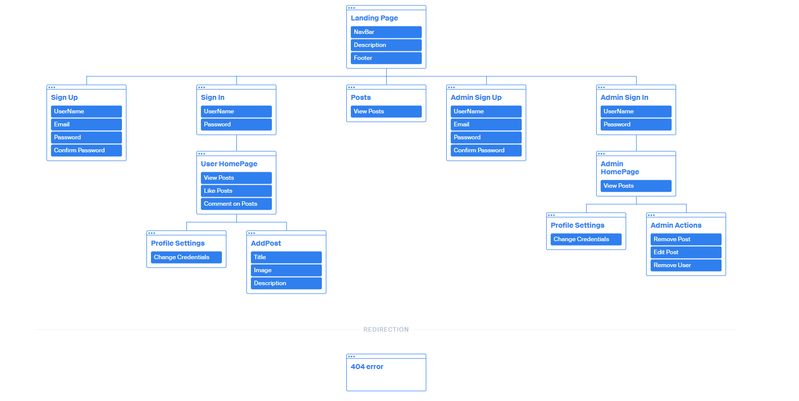

# Proposal

### Team Members

- Tushan Shahid
- Abhimanyu Kinra

---

### Project Description

The aim of PostWatch is to provide an online platform for users to showcase their watch collections and connect with other watch enthusiasts. This blogging website will allow users to create an account so that they can upload pictures and descriptions of their watches. They will aslo be able to interact with the community as this platform will allow them to view and comment on other users' posts. The website aims to provide a clean and intuitive interface for users to easily navigate and discover new posts about watches. The website will feature a user-friendly design and responsive layout for mobile and desktop.

---

### Functional Requirements

- Non-registered users can view the posts of other users.
- Users can create an account and log in to the website.
- Password recovery for users via email .
- Users can upload pictures and descriptions of their watches.
- Users can view other users' posts on their homepage.
- Users can comment on other users' posts.
- Users can like other users' posts.
- Users homepage will feature top liked posts.
- Users homepage will also feature lastest posts.
- User's homepage will be updated based on hot(trending) posts.
- Users can search for specific post that they're interested in.
- Users will have settings page to change password and username.
- Posts will be shown on the feed page in chronological order.
- Website will feature user-friendly navigation.
- Responsive design for mobile and desktop.
- Admins can search for a user by their name, email or posts.
- Admins can enable and disable user profiles.
- Admins can edit/remove posts made by users.
- Forms will be validated to ensure security.
- Bootstrap will be used for styling.
- PHP will be used for backend.
- AJAX to ensure asynchrounous updates.
- MySQL will be used for database.

---

### Site Map

---

### Tentative Project Schedule

- Febuary 12th - Finish the proposal with the site map.
- Febuary 16th - Have the layout document and the logic processes finalized.
- Febuary 18th - Finish most of the client-side code including security and validation.
- Febuary 20th - Finish any remaining documents/functionalities and submit the deliverable with a functional client-side experience.
- Febuary 27th - Finish most of the core functional components (baseline objectives) alongside database functionality.
- March 3rd - Finish bulk of the server side code and ensure that its asynchronously updating.
- March 6th - Finish the preliminary summary alongside any remaining deliverable and upload it on cosc360.ok.ubc.ca
- March 14th - Ensure that all minial objectives have been met alongside full client-side and server-side implementation.
- March 25th - Make sure that the website has aditional functionaly and working properly.
- March 30th - Deploy the website and perform client and server side unit testing to fix any bugs and ensure smooth functionality.
- April 5th - Have the documentation ready alongside all the code for review.
- April 7th - Final review of the entire website alongside the documents before the final submission on this day.

---
